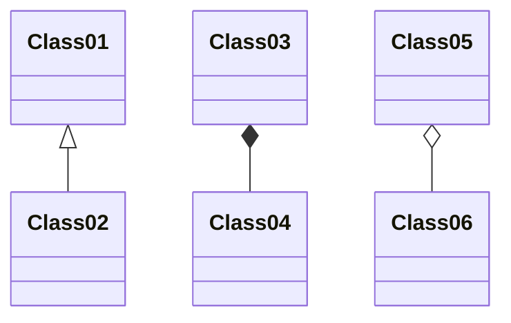
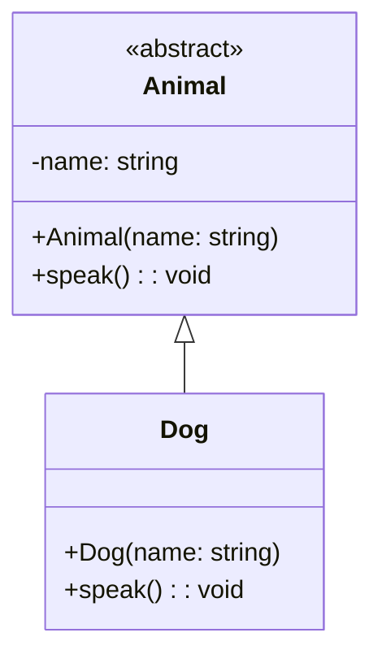

¿Qué es Mermaid?

Mermaid es un lenguaje de marcado simple que te permite generar diagramas (flujo, Gantt, clases…) directamente en Markdown, sin herramientas de dibujo.
Un diagrama de clases Mermaid luce así:


Por ejemplo, el siguiente código cpp:
```cpp
// include/animal.h
#ifndef ANIMAL_H
#define ANIMAL_H
#include <string>

class Animal {
public:
    Animal(const std::string& n);
    virtual void speak() const = 0;
protected:
    std::string name;
};
#endif

// include/dog.h
#ifndef DOG_H
#define DOG_H
#include "animal.h"

class Dog : public Animal {
public:
    Dog(const std::string& n);
    void speak() const override;
};
#endif
```

Se puede diagramar así:



**Claves de la sintaxis**  
- `class ClassName { ... }` define una clase y su cuerpo.  
- Dentro del cuerpo:
  - `+` público, `-` privado, `#` protegido  
  - `<<abstract>>` estereotipo  
  - Método con firma: `+speak(): void`  
  - Atributo: `-name: string`  
- Relación de herencia: `Base <|-- Derived`  
- Composición: `Part *-- Whole`  
- Agregación: `Part o-- Whole`  
- Asociación simple: `ClassA --> ClassB`

